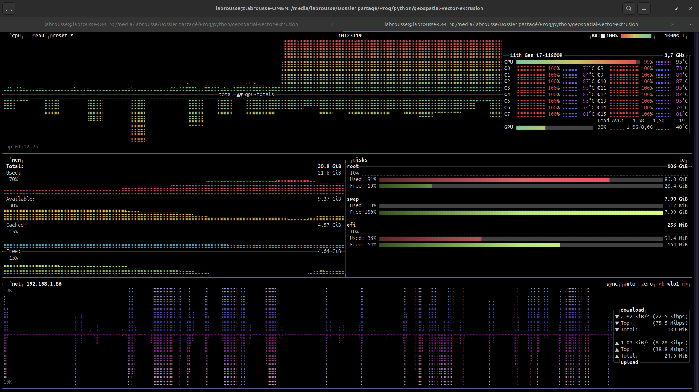
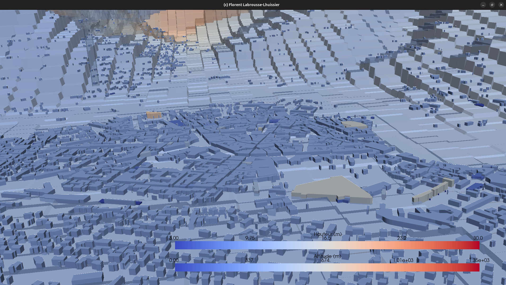
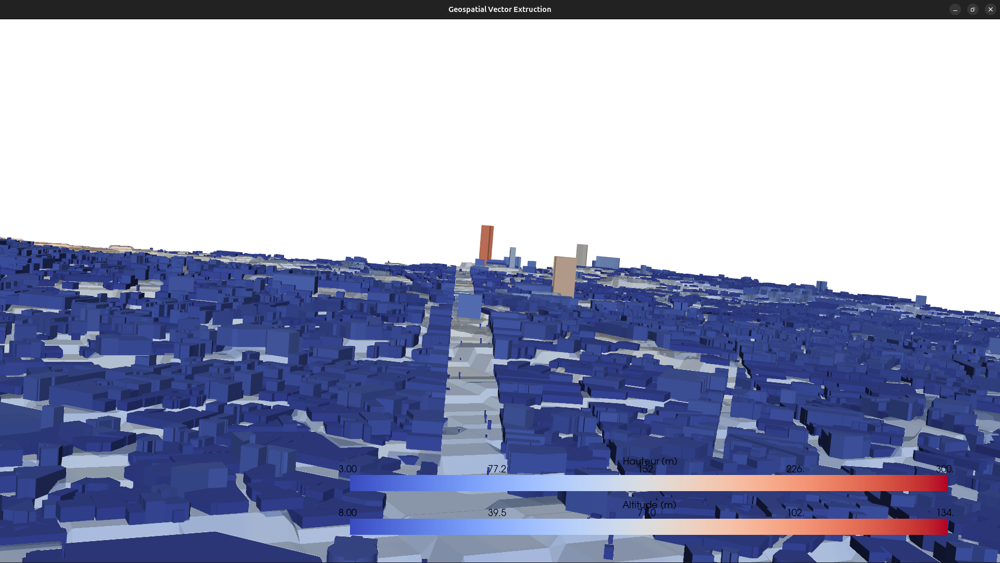
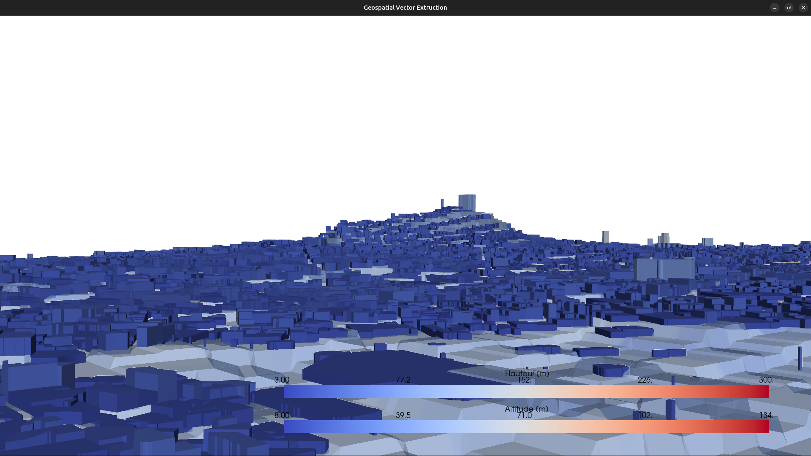
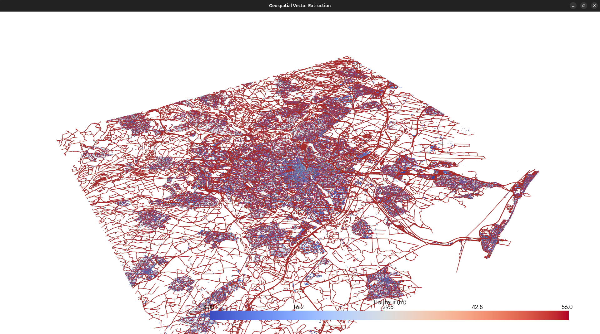
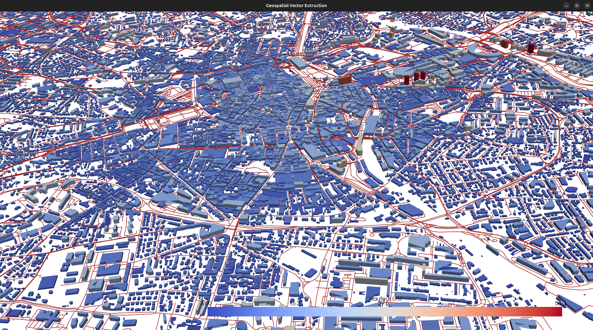
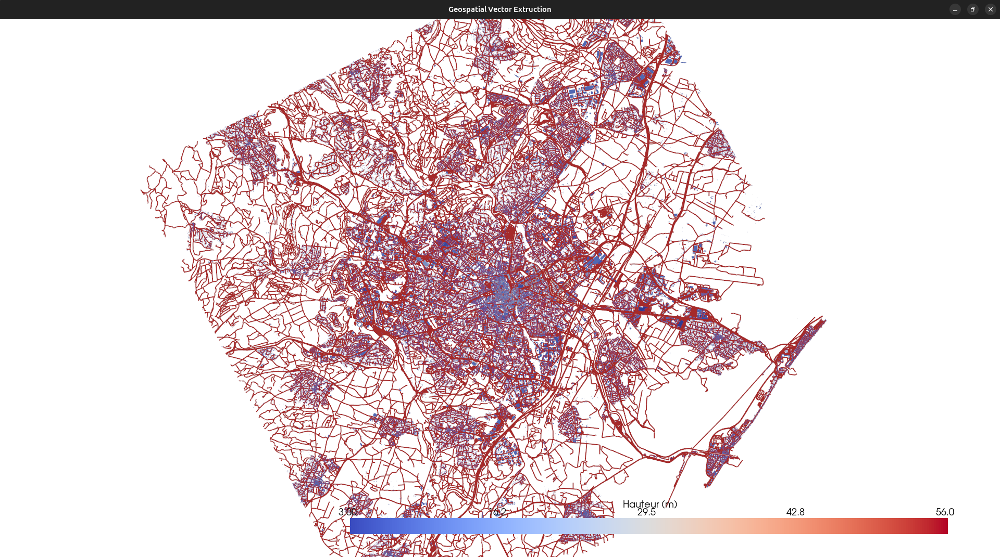

# Documentation du Script de Visualisation 3D de Villes

## Table des matières

1. [Introduction](#introduction)
2. [Prérequis](#prérequis)
3. [Installation](#installation)
4. [Configuration](#configuration)
5. [Architecture du Script](#architecture-du-script)
6. [Multiprocessing](#multiprocessing)
7. [Fonctions Détaillées](#fonctions-détaillées)
8. [Flux de Données](#flux-de-données)
9. [Formats de Données](#formats-de-données)
10. [Exemples d'Utilisation](#exemples-dutilisation)
11. [Dépannage](#dépannage)

---

## Introduction

Ce script Python génère des visualisations 3D interactives de villes à partir des données OpenStreetMap (OSM). Il combine :

- **Bâtiments** : Extraits d'OSM avec leurs hauteurs réelles
- **Rues** : Réseau routier complet (voitures, piétons, vélos)
- **Terrain** : Relief topographique basé sur les données d'élévation SRTM

Le résultat est une vue 3D interactive que vous pouvez explorer avec la souris.

**Performance** : Le script utilise le multiprocessing (`ProcessPoolExecutor`) pour paralléliser tous les calculs intensifs sur tous les cœurs CPU disponibles.

---

## Prérequis

### Logiciels requis

- Python 3.8+
- Conda (recommandé pour la gestion des dépendances)

### Bibliothèques Python

| Bibliothèque | Version | Description |
|--------------|---------|-------------|
| `osmnx` | ≥1.0 | Extraction de données OpenStreetMap |
| `pyvista` | ≥0.35 | Visualisation 3D et manipulation de maillages |
| `pandas` | ≥1.3 | Manipulation de données tabulaires |
| `numpy` | ≥1.20 | Calculs numériques |
| `shapely` | ≥1.8 | Manipulation de géométries |
| `srtm.py` | ≥0.3 | Téléchargement des données d'élévation SRTM |
| `pyproj` | ≥3.0 | Transformation de coordonnées |
| `multiprocessing` | (stdlib) | Parallélisation sur tous les cœurs CPU |
| `concurrent.futures` | (stdlib) | ProcessPoolExecutor pour le traitement par lots |

---

## Installation

### 1. Créer l'environnement Conda

```bash
conda create -n carte3d python=3.10
conda activate carte3d
```

### 2. Installer les dépendances principales

```bash
conda install -c conda-forge osmnx pyvista pandas numpy shapely pyproj
```

### 3. Installer les dépendances supplémentaires

```bash
pip install srtm.py
```

### 4. Lancer le script

```bash
python Main.py
```

---

## Configuration

La configuration se trouve à la fin du fichier `Main.py` :

```python
# === CONFIGURATION ===
location = "Montpellier, France"    # Lieu à visualiser
radius = 500                         # Rayon en mètres

# Options d'affichage
SHOW_TERRAIN = True           # Afficher le relief/topographie
SHOW_BUILDINGS = True         # Afficher les bâtiments
SHOW_STREETS = True           # Afficher les rues
COLOR_BY_HEIGHT = True        # Colorer les bâtiments selon leur hauteur
TERRAIN_RESOLUTION = 100      # Résolution du terrain (50-500 recommandé)
TERRAIN_EXAGGERATION = 3.0    # Exagération verticale du relief
BUILDING_EXAGGERATION = 1.0   # Exagération de la hauteur des bâtiments
STREET_COLOR = 'white'        # Couleur des rues
# =====================
```

### Détail des paramètres

| Paramètre | Type | Description |
|-----------|------|-------------|
| `location` | str | Nom du lieu (géocodé par Nominatim) |
| `radius` | int | Rayon de la zone en mètres |
| `SHOW_TERRAIN` | bool | Active/désactive le terrain 3D |
| `SHOW_BUILDINGS` | bool | Active/désactive les bâtiments |
| `SHOW_STREETS` | bool | Active/désactive les rues |
| `COLOR_BY_HEIGHT` | bool | Coloration par hauteur (sinon gris) |
| `TERRAIN_RESOLUTION` | int | Points par axe pour le terrain |
| `TERRAIN_EXAGGERATION` | float | Facteur d'exagération verticale du terrain |
| `BUILDING_EXAGGERATION` | float | Facteur d'exagération des bâtiments |
| `STREET_COLOR` | str | Couleur des rues (nom ou hex) |

### Conseils de performance

- **Petite zone** (< 500m) : `TERRAIN_RESOLUTION = 50-100`
- **Zone moyenne** (500m-2km) : `TERRAIN_RESOLUTION = 100-200`
- **Grande zone** (> 2km) : `TERRAIN_RESOLUTION = 200-500`

Le multiprocessing accélère considérablement le traitement, mais une résolution très élevée reste coûteuse.

---

## Architecture du Script

Le script est organisé en 7 sections principales :

```
┌─────────────────────────────────────────────────────────────┐
│  1. IMPORTS & MULTIPROCESSING SETUP                         │
│     Configuration de l'environnement Python                 │
│     Détection du nombre de cœurs CPU (NUM_CORES)            │
├─────────────────────────────────────────────────────────────┤
│  2. EXTRACTION OSM                                          │
│     extract_osm_data() - Télécharge bâtiments et rues       │
├─────────────────────────────────────────────────────────────┤
│  2b. DONNÉES TERRAIN (PARALLÉLISÉ)                          │
│     create_terrain_mesh() - Crée le relief 3D               │
│     _fetch_elevation_row() - Worker parallèle               │
├─────────────────────────────────────────────────────────────┤
│  3. GÉNÉRATION EMPREINTES                                   │
│     generate_footprints_with_heights() - Extrait polygones  │
├─────────────────────────────────────────────────────────────┤
│  4. CRÉATION BÂTIMENTS 3D (ENTIÈREMENT PARALLÉLISÉ)         │
│     _create_building_data() - Données d'un bâtiment         │
│     _process_building_batch() - Worker par lots             │
│     extrude_buildings() - Extrusion + fusion rapide         │
├─────────────────────────────────────────────────────────────┤
│  5. EXPORT                                                  │
│     save_to_obj() - Sauvegarde en format OBJ                │
├─────────────────────────────────────────────────────────────┤
│  6. CONVERSION RUES (ENTIÈREMENT PARALLÉLISÉ)               │
│     _process_street_batch() - Worker par lots               │
│     streetGraph_to_pyvista() - Convertit le graphe en 3D    │
├─────────────────────────────────────────────────────────────┤
│  7. CONFIGURATION & VISUALISATION                           │
│     Code principal d'exécution                              │
└─────────────────────────────────────────────────────────────┘
```

---

## Multiprocessing

### Principe

Le script détecte automatiquement le nombre de cœurs CPU disponibles et les utilise tous pour accélérer les calculs :

```python
NUM_CORES = mp.cpu_count()
print(f"⚡ Multiprocessing activé: {NUM_CORES} cœurs CPU disponibles")
```

### Points de parallélisation

| Étape | Fonction Worker | Stratégie |
|-------|-----------------|-----------|
| Terrain | `_fetch_elevation_row()` | Une tâche par ligne de la grille |
| Bâtiments | `_process_building_batch()` | Traitement par lots (batch_size = total / (NUM_CORES × 4)) |
| Rues | `_process_street_batch()` | Traitement par lots |

### Traitement par lots (Batch Processing)

Pour les bâtiments et les rues, les données sont divisées en lots :

```python
batch_size = max(1, total // (NUM_CORES * 4))
```

Chaque worker traite un lot complet, ce qui réduit l'overhead de communication entre processus.

### Fusion rapide des meshes

Au lieu d'utiliser la fusion séquentielle de PyVista (complexité O(n²)), le script utilise une concaténation directe des tableaux numpy (complexité O(n)) :

```python
# Concaténation directe des vertices
combined_vertices = np.vstack(all_vertices)

# Ajustement des indices de faces
for idx, vertices, faces, height in all_results:
    # Décalage des indices pour chaque mesh
    adjusted_faces = adjust_face_indices(faces, vertex_offset)
    all_faces.extend(adjusted_faces)
    vertex_offset += len(vertices)

# Création du mesh unique
city_mesh = pv.PolyData(combined_vertices, np.array(all_faces))
```

Cette optimisation est critique pour les grandes villes avec des milliers de bâtiments.

### Indicateurs de progression

Chaque étape parallélisée affiche un pourcentage de progression :

```
  → Élévation: 75%
  → Extrusion bâtiments: 50%
  → Conversion rues: 100% ✓
```

---

## Fonctions Détaillées

### `extract_osm_data(location, radius, download_buildings, download_streets)`

**But** : Télécharge les données géographiques depuis OpenStreetMap.

**Processus** :
1. Géocode le lieu pour obtenir les coordonnées (lat, lon)
2. Télécharge les bâtiments avec le tag `building=*`
3. Télécharge le réseau routier (tous types)
4. Projette les données en Lambert-93 (EPSG:2154)

**Retourne** :
- `buildings` : GeoDataFrame des bâtiments
- `streets` : Graphe NetworkX du réseau routier
- `center_point` : Tuple (latitude, longitude)

---

### `_fetch_elevation_row(args)` (Worker parallèle)

**But** : Récupère les élévations pour une ligne de la grille terrain.

**Arguments** :
- `row_idx` : Index de la ligne
- `lat_row` : Tableau des latitudes
- `lon_row` : Tableau des longitudes

**Retourne** :
- `(row_idx, row_elevations)` : Index et élévations de la ligne

---

### `create_terrain_mesh(center_point, radius, resolution, z_exaggeration)`

**But** : Crée un maillage 3D du terrain basé sur les données d'élévation SRTM.

**Processus** :
1. Calcule la boîte englobante en coordonnées géographiques
2. Crée une grille de points (resolution × resolution)
3. **Parallélise** : Récupère l'élévation pour chaque ligne via `ProcessPoolExecutor`
4. Transforme les coordonnées en Lambert-93
5. Applique l'exagération verticale
6. Crée un maillage PyVista StructuredGrid

**Retourne** :
- `terrain` : Maillage PyVista du terrain
- `elevation_data` : Objet SRTM pour requêtes ultérieures
- `transformer` : Objet pyproj pour transformations
- `z_exaggeration` : Facteur d'exagération utilisé

---

### `generate_footprints_with_heights(buildings)`

**But** : Extrait les empreintes des bâtiments avec leurs hauteurs réelles.

**Sources de hauteur (par ordre de priorité)** :
1. Attribut OSM `height` (hauteur en mètres)
2. Attribut OSM `building:levels` × 3m par étage
3. Hauteur par défaut : 10m

**Gestion des géométries** :
- `Polygon` : Ajouté directement
- `MultiPolygon` : Décomposé en polygones individuels
- Autres types : Ignorés

**Retourne** :
- `footprints` : Liste de polygones Shapely
- `heights` : Liste des hauteurs correspondantes

---

### `_create_building_data(coords, height, ground_elevation)`

**But** : Crée les données brutes (vertices et faces) pour un bâtiment.

**Structure du bâtiment** :
- Base : n vertices au niveau du sol
- Toit : n vertices au niveau sol + hauteur
- Murs : n faces quadrilatères

**Retourne** :
- `vertices` : Array numpy des vertices (2n × 3)
- `faces` : Array numpy des indices de faces (format PyVista)

---

### `_process_building_batch(args)` (Worker parallèle)

**But** : Traite un lot de bâtiments en parallèle.

**Pour chaque bâtiment du lot** :
1. Transforme les coordonnées pour obtenir lat/lon du centroïde
2. Récupère l'élévation du terrain
3. Applique l'exagération du terrain
4. Crée les données du bâtiment via `_create_building_data()`

**Retourne** :
- Liste de tuples `(idx, vertices, faces, height)`

---

### `extrude_buildings(footprints, heights, elevation_data, z_exaggeration, building_exaggeration)`

**But** : Extrude toutes les empreintes en bâtiments 3D (entièrement parallélisé).

**Processus** :
1. Prépare les données de tous les bâtiments
2. Divise en lots pour le multiprocessing
3. **Parallélise** : Traite les lots via `ProcessPoolExecutor`
4. Trie les résultats par index
5. **Fusion rapide** : Concatène les vertices et ajuste les indices de faces
6. Crée le mesh unique avec attribut `height` pour la colormap

**Retourne** :
- `city_mesh` : Maillage combiné de tous les bâtiments
- `[]` : Liste vide (pour compatibilité)

---

### `_process_street_batch(args)` (Worker parallèle)

**But** : Traite un lot de segments de rue en parallèle.

**Pour chaque segment** :
1. Récupère les coordonnées X, Y
2. Transforme pour obtenir lat/lon
3. Récupère l'élévation pour chaque point
4. Ajoute un décalage de 0.5m au-dessus du sol

**Retourne** :
- Liste de tuples `(idx, points_3d)`

---

### `streetGraph_to_pyvista(st_graph, elevation_data, z_exaggeration)`

**But** : Convertit le graphe des rues en lignes 3D PyVista (entièrement parallélisé).

**Processus** :
1. Extrait les arêtes du graphe OSMnx
2. Prépare les données de toutes les rues
3. Divise en lots pour le multiprocessing
4. **Parallélise** : Traite les lots via `ProcessPoolExecutor`
5. Trie les résultats par index
6. **Fusion rapide** : Construit les indices de lignes pour PyVista

**Retourne** :
- `PolyData` PyVista avec lignes

---

## Formats de Données

### Système de coordonnées

| Étape | Système | Code EPSG | Description |
|-------|---------|-----------|-------------|
| Entrée OSM | WGS84 | 4326 | Coordonnées GPS (lat, lon) |
| Traitement | Lambert-93 | 2154 | Projection française (mètres) |
| Visualisation | Lambert-93 | 2154 | Coordonnées en mètres |

### Format des maillages PyVista

**Points** : Array numpy de shape `(n_points, 3)`
```python
[[x1, y1, z1],
 [x2, y2, z2],
 ...]
```

**Faces** : Array plat avec format `[n_vertices, v1, v2, ..., vn]`
```python
[4, 0, 1, 2, 3,    # Quad (4 vertices)
 3, 4, 5, 6,       # Triangle (3 vertices)
 ...]
```

---

## Exemples d'Utilisation

### Visualiser une ville avec relief

### Millau (France) : 


Rendu (oui, il faut un pc puissant ^^)




```python
location = "Millau, France"
radius = 30000
SHOW_TERRAIN = True
SHOW_BUILDINGS = True
SHOW_STREETS = False
TERRAIN_EXAGGERATION = 2.0
TERRAIN_RESOLUTION = 10000
```

Rendu en entier : 


Vue sur la ville de Millau et son environnement : 


Zoom sur la ville



### Paris (France)

Voici la page de chargement avec un total de 123 937 batiments


```python
location = "Paris, France"
radius = 5000
SHOW_TERRAIN = True
SHOW_BUILDINGS = True
SHOW_STREETS = False
TERRAIN_RESOLUTION = 1000
TERRAIN_EXAGGERATION = 3.0 
```

Voici une vue d'ensemble de Paris : 


De plus bas : 


Champs Élysées : 



butte Montmartre :




### Montpellier (France) Batiments et rues

```python
location = "Montpellier, France"
radius = 5000
SHOW_TERRAIN = True
SHOW_BUILDINGS = True
SHOW_STREETS = False
TERRAIN_RESOLUTION = 1000
TERRAIN_EXAGGERATION = 3.0 
```








___

### Exporter en OBJ

```python
# Après la génération du maillage
save_to_obj(mesh, "output/ma_ville.obj")
```

---

## Dépannage

### Erreur : "Connection refused" lors du téléchargement OSM

**Cause** : Serveur Overpass surchargé ou connexion internet instable.

**Solution** : Attendre quelques minutes et réessayer.

### Le terrain est plat

**Causes possibles** :
1. Zone sans données SRTM (océan, certaines régions)
2. `TERRAIN_EXAGGERATION` trop faible

**Solution** : Augmenter `TERRAIN_EXAGGERATION` à 5-10.

### Visualisation lente / crash mémoire

**Cause** : Trop de données (grand rayon + haute résolution).

**Solutions** :
1. Réduire `TERRAIN_RESOLUTION`
2. Réduire `radius`
3. Désactiver certaines couches (`SHOW_STREETS = False`)

### Les bâtiments flottent au-dessus du terrain

**Cause** : Incohérence entre les données d'élévation du terrain et des bâtiments.

**Solution** : Vérifier que `TERRAIN_EXAGGERATION` est bien transmis aux bâtiments.

### Le multiprocessing ne fonctionne pas sur Windows

**Cause** : Sur Windows, le multiprocessing nécessite que le code soit dans un bloc `if __name__ == "__main__":`.

**Solution** : C'est déjà le cas dans ce script. Si le problème persiste, essayez de réduire `NUM_CORES` manuellement.

---

## Auteur

**Florent Labrousse-Lhuissier**

---

## Licence

Ce projet est fourni à des fins éducatives.